# asyncgate

## 👾 서비스 소개

### 👾 아키텍처 설계부터 실시간 통신 기능까지, End-to-End 경험을 담아요

> Asyncgate는 서비스의 핵심 키워드인 **Asynchronous**와 **Gateway**를 결합한 이름으로 언제 어디서나 끊김 없는 소통을 가능하게 하는 의미를 담았어요.  
> Discord 클론 프로젝트로, WebSocket 기반의 채팅과 WebRTC를 활용한 음성·영상 통화를 지원해 사용자들이 자연스럽게 대화하고 협업할 수 있는 환경을 제공해요. 단순한 메신저 플랫폼을 넘어서 개발자와 사용자가 모두 만족할 수 있는 안정적인 아키텍처와 직관적인 경험을 동시에 지향해요.

## ⚙️ 서비스 아키텍처

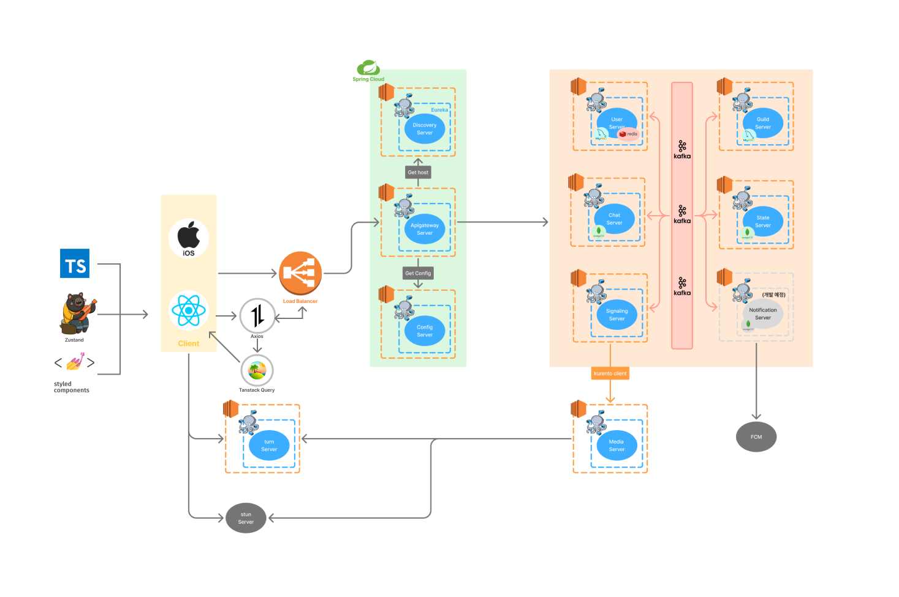

## 🛠️ 주요 기술 소개

### 채팅

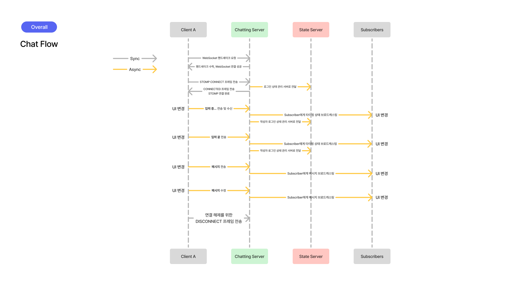

### 음성·영상 통화

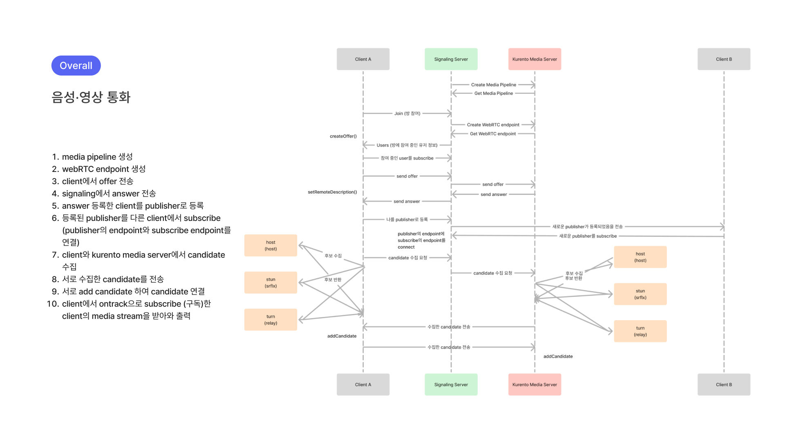

### FE

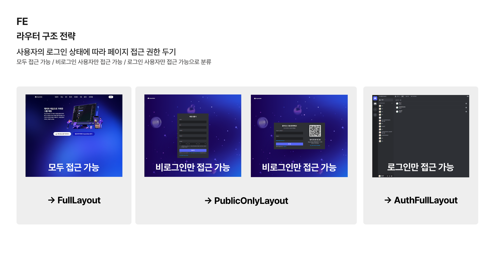
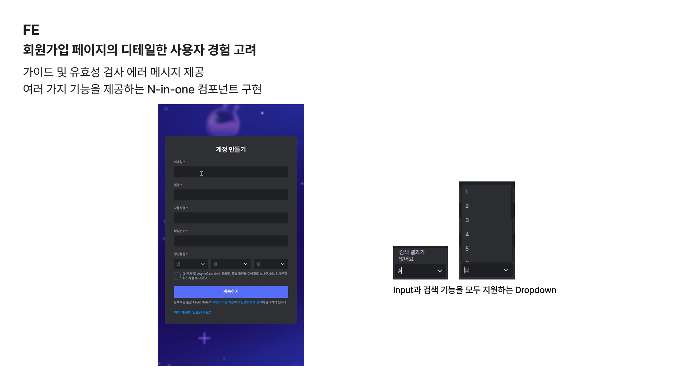
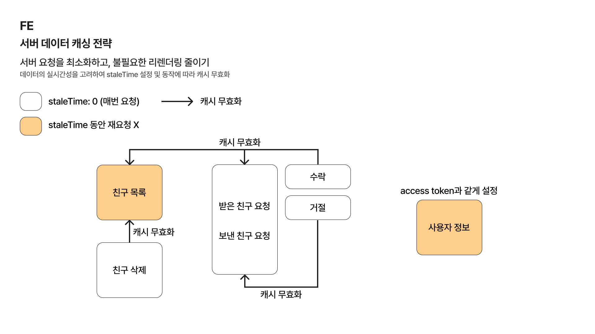
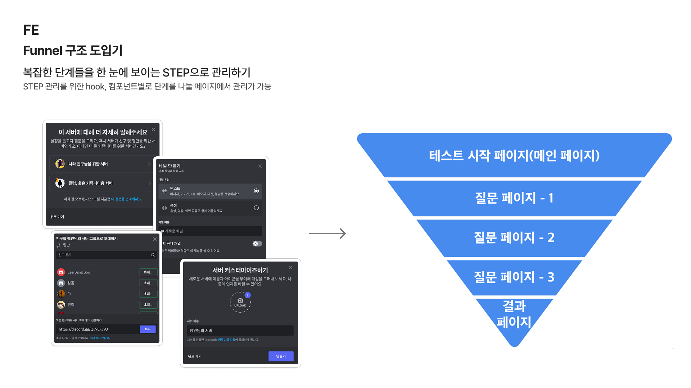
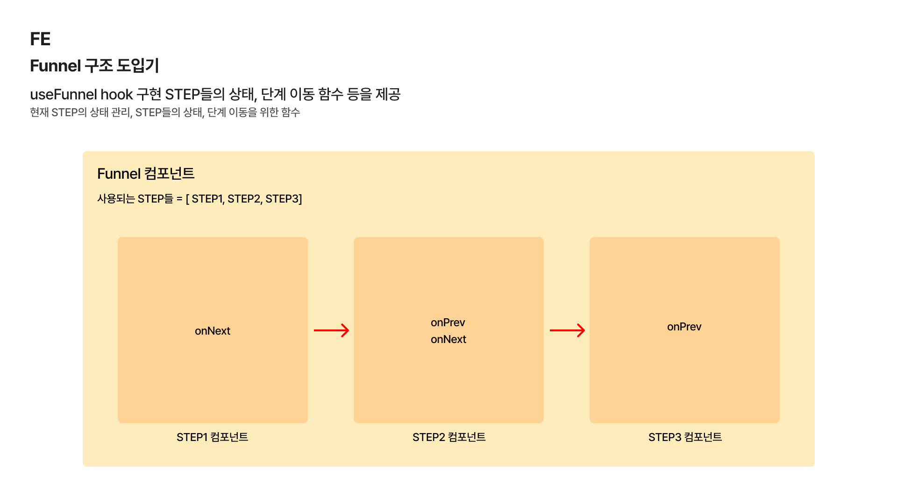
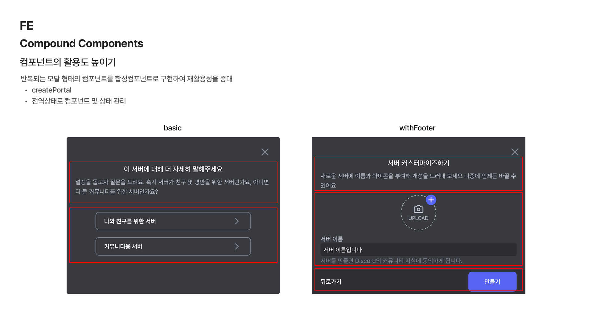

## 🫂 팀원 소개

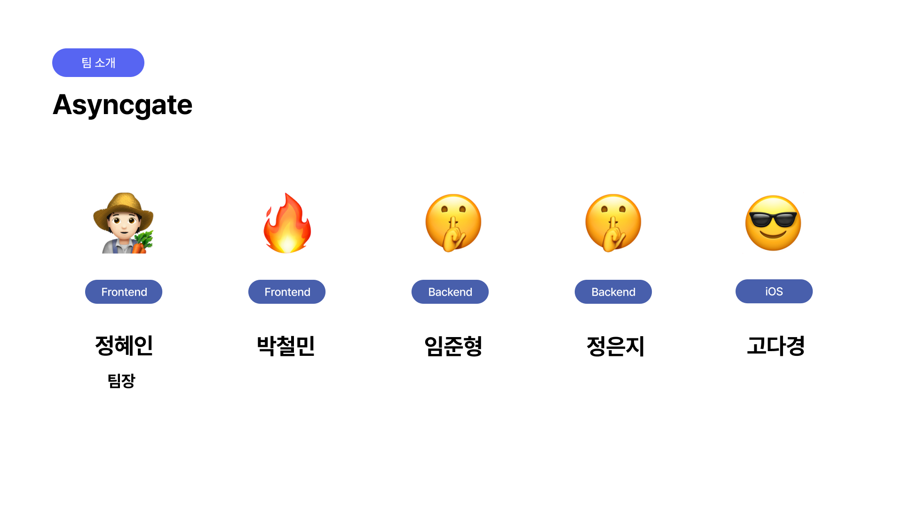

### 🙌 기타

> asyncgate는 팀원이 함께 성장할 수 있도록 문서 공유를 병행하며 작업을 진행했어요

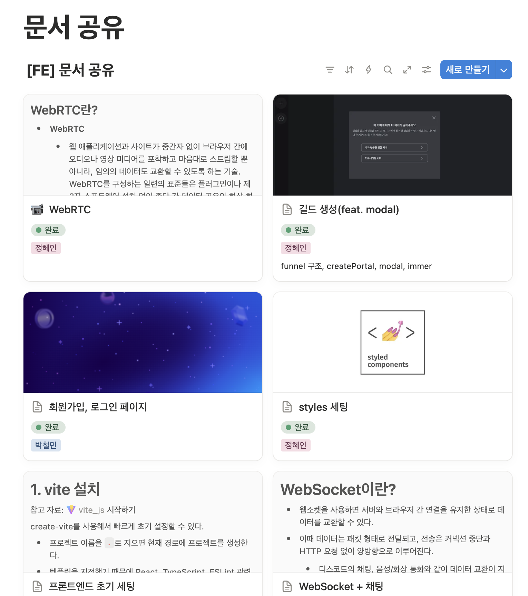
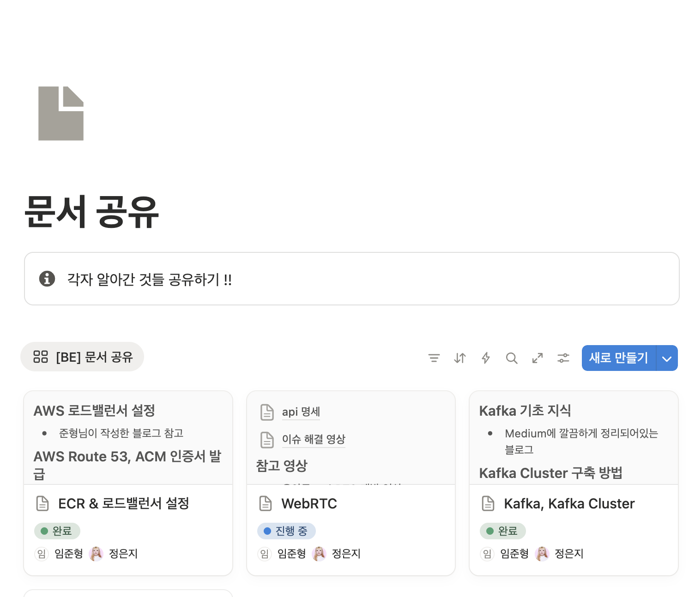

## Commit Convention

| Type       | Description                   |
| ---------- | ----------------------------- |
| `feat`     | 새로운 기능 추가              |
| `fix`      | 버그 수정                     |
| `design`   | CSS 등 사용자 UI 디자인 변경  |
| `!HOTFIX`  | 급한 변경                     |
| `refactor` | 프로덕션 코드 리팩토링        |
| `docs`     | 문서 작성 및 수정             |
| `test`     | 테스트 추가 및 리팩토링       |
| `setting`  | 패키지 설치 등 개발 환경 설정 |

## Commit Content Convention

ex) [iOS/FE/BE/ALL] feat: ~~~ (#1)

## PR Convention

ex) [iOS/FE/BE/ALL] feat: ~~~

## Branch Convention

ex) fe/feat/25-branch-name
